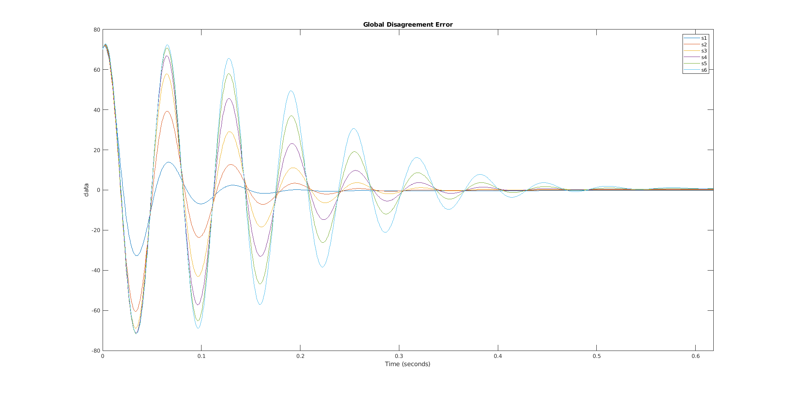

# Distribuited control of a multi-agents magnetic levitation system

> Antonio Minonne, Anna Paola Musio, Samuele Paone, Salvatore Pappalardo 
> s280095, s281988, s287804, s281621

# Introduction 

This project implements a system of 6 distribuited magnetic levitation systems, linearized in an equilibrium point. We applied the theory as described in chapter 3 of the book [Cooperative Control of Multi-Agent Systems](https://link.springer.com/book/10.1007/978-1-4471-5574-4). 
In the first section we briefly explain the simulink model and the code used for the simulations, as well as the other files of the project. The second section briefly analize the performance of different network structures in terms of Global Disagreement Error on the output of the systems. The third section is dedicated to the comparison of the performances when using either a distributed observer or a local one. Finally, the last section explains a slightly different architecture that works for our systems, even tough we could not proove the general case.

# Files arrangement

For information about the simulink and matlab implementation, please refer to the file [README.md](./README.md).

There are 4 types of files.

## `stable_` prefix
These files are related to the theory as seen in class lessons. Each magnetic levitator is controlled using the pole-placement method. In order to do that, since the state of the system is not measureable, we neede to add an observer which provided the state, given its output.

The "placed poles" are chosen in order to impose a specific trajectory to the leader. 

Each other agent is virtually connected to all the otget agent. Whether the connection actually exists depend on the adjacency matrix of the graph.

Each agent also have an observer as explained by the theory, which serve the purpose of estimating the controlled state to calculate $\epsilon$. This kind of architecture is a bit redundant, since we already have an observer, but it is necessary to underline that the two observer estimate different states, specifically: the internal one estimate the actual state of the maglev, the external one estimate the state of the **controlled maglev**.

## `alternative_` prefix

These files are relative to the _slightly different_ architecture as mentined above. For further informations, read the last section of this document. 

Regarding the files, they are an almost exact copy of the `stable_` files.

# `metric_` prefix

These files contain useful functions needed to score the performance of the system.

The file `metrics.txt` contains a description of each implemented metric.

# `v` prefix
Each of these files contains a different configuration for the system. The file versions.txt explains what each version does.

# Network structure analysis
> If no

## Chain structure
We performed several experiments with chain structure. In the cases where there wasn't a forward edge between follwer nodes, or loop structures in the chain.

### Observation 1

*In a chain structure network, where there aren't forward edges among follower nodes or loop structures in the chain, if we have nodes i and j, and node j is the successor nodes of node i in the chain , and all the weights associated with the edges are equal:*
$$
Tc_{j}>Tc_{i}  
$$
*where:*
-  $Tc_{j}$ *is the convergence time of node j*
- $Tc_{i}$ *is the convergence time of node i*

In the following, we report the table of the convergence times for each nodes,
 
| Node $i$ | Convergence time  |	
|--|--|
|1|11.2141|
|2|12.0108|
|3|12.4916|
|4|12.8382|
|5|13.1102|
|6|13.3334|

We went forward with the experiments changing the weights associated with the edges, with the same network topology described previously. We have noticed that *Observation 1* is still true and also we observed that,

### Observation 2
*In a chain structure, like the one described in Obeservtion 1, if node j is the successor of node i, and $w_{(j,i)}$  is the weight associated with the edges (i,j), then,*

$$
w_{(j,i)}\rightarrow \infty \Rightarrow Tc_{j} \rightarrow Tc_{i}
$$
*where:*
-  $Tc_{j}$ *is the convergence time of node j*
- $Tc_{i}$ *is the convergence time of node i*

In fact , in our example, inscreasing the weight associated with the edges $(5,6)$ up to 100, leaving all others weight in the network equal to 1,  we can notice that $Tc_6$ approaches  $Tc_5$, without ever going under it. From the table shown in the following we can see how, with this new configuration of weights,   $Tc_{6}\simeq Tc_{5}$.

|Node $i$ | Convergence Time|
|--|--|
|1|11.2141|
|2|12.0108|
|3|12.4916|
|4|12.8382|
|5|13.1102|
|6|13.1122|

We can have a better idea of the impact that the weights have on convergence time of a generic node $i$, looking at its global disagreement error (GDE), in the following we report the trend of GDE for each node in experiment one and two.

We can see that the trends of GDE for each node in the experimet one are equidistant from each other, because all weights are set to 1.  On the other hand in the *experiment 2* we can notice that the GDE trend of nodes 6 collapses on the GDE trend of node 5. The reason of this behaviour is that, for this experiment we set $w_{6,5}=100$ .

After the experiments described previously, we changed the network topografy, by adding a forward edge. From that experiment we noticed that the node, that receive the information thanks to the forward edge, reduces its convergence time in according to "euristich " rules.

### Observation 3
*If in a chain structure, like the one described previously, we add a forward edge from node $i$ to node $j$, the improvment on convergence time of node j depends on:*
-  $$d_{li}=\sum_{k=1}^i \frac{1}{w_{(k,k-1)}}$$ 
*The sum of the weights's reciprocals associated with the edges among leader node and $i$*

- $$d_{ij}=\sum_{k=i}^j \frac{1}{w_{(k,k-1)}}$$
 *The sum of the weight's reciprocals of the weights associated with the edges among $i$ and $j$ in the original chain structure*

-  $$d_{fij}=\frac{1}{w_{(j,i)}}$$
*The weight's reciprocal associated with the forward edge $(i,j)$*

To better understand the behavior of node convergence , we tried different configuration of chain structures by adding for every try different edges.
##### Configuration 1

##### Configuration 2

##### Configuration 3

In this experiment all weights associated with the edges for all structure are set to one. In fact, the aim now is to study the convergence time for different networks topolgy. In particular we focus our attention on node 6 because we modify only the input degree of this node and the nodes from where it gets information. The results for this experiments are shown below.

##### Time Convergece table 
|Node $i$|Time Convergence Configuration 1|Time Convergence Configuration 2|Time Convergence Configuration 3|
|--|--|--|--|
|1|11.2141|11.2141|11.2141|
|2|12.0108|12.0108|12.0108|
|3|12.4916|12.4916|12.4916|
|4|12.8382|12.8382|12.8382|
|5|13.1102|13.1102|13.1102|
|6|12.8382|12.9828|13.1102|

We noticed that the first configuration collapses to a binary tree structure, (which will be discussed better later), in fact the behaviour on nodes 6 is equal to the behaviour of node 6 .

 In the second configuration the nodes 6 converges with greater delay respect the first configuration, despite we leave the forward edge  from node 3 to node 6. But node 6 converges before node 5. This makes us suspect that the information that node 6 take by node 5, increases the convergence time. 

In the third configuration node 6 take information by node 4, a node that is farther from the leader respect nodes 3 and we noticed that the time convergence of node 6 increases, exceeding the convergence time of node 5.

#### Heuristics rule
*In a chain configuration structure, if all edges have the same weights,when we apply a forward edge from node i to node j, decreasing $d_{li}$, $d_{ij}$ and $d_{fij}$, we increase the improvement in terms of convegece time*

 

 

## Tree structure

The tree structure is shown in the following figure

We anayzed 6 different network configurations with different weights. Those are summurized in the following table. 

| n   | Configuration         | 0->1 | 0->2 | 1->3 | 1->4 | 2->5 | 2->6 |
| --- | --------------------- | ---- | ---- | ---- | ---- | ---- | ---- |
| 1   | Equal weights at 1    | 1    | 1    | 1    | 1    | 1    | 1    |
| 2   | Increasing weights    | 1    | 1    | 10   | 10   | 10   | 10   |
| 3   | Decreasing weights    | 10   | 10   | 1    | 1    | 1    | 1    |
| 4   | Same convergence time | 1    | 1    | 100  | 100  | 100  | 100  |
| 5   | Big equal weights     | 1e10 | 1e10 | 1e10 | 1e10 | 1e10 | 1e10 |
| 6   | Asymmetric weights    | 1    | 10   | 1    | 10   | 1    | 10     |

The following figures illustrates the step response and the **global disagreement error** (GDE) with respect to the output of each system.

The first notable thing is that the convergence time does not depend on the value of the weight itself, but rather there seems to exist a relationship which quantifies the similarity of the behaviours and the convergence times.

Where $d$ is the depth of the node and each $w_j$ is the weight of the edge on the j-th step.
- the convergence time,
- the depth of the considered node,
- the product of the weights of the traversed edges.

Indeed, when comparing `Configuration 1` and `Configuration 5` (in which the difference is only the magnitude of the weights) we can clearly see that they have the same behaviour even though completely different weights. 
On the other hand, `Configurations` `1`, `2` and `4` have increasingly similar behaviour, with the slower nodes matching the behaviour of the faster ones.

Another important aspect to underly is the _class of convergence_. In the context of the first five configurations, only two curves are clearly visibile. This happens because nodes `s1` and `s2` converge at the same time: they _belong to the same class_.  The same can be said for nodes `s3`, `s4`, `s5` and `s6`.

Altough there seems to be a simple relationship, the next example demonstrates things are more complicated. 

In `Configuration 6` the tree is _unbalanced_ and this fact heavily modify the behaviour. The table shows the convergence times of the nodes for this configuration in increasing order:

| node | convergence time |
| ---- | ---------------- |
| 2    | 9.13             |
| 6    | 9.62             |
| 1    | 11.21            |
| 4    | 11.32            |
| 5    | 11.32            |
| 3    | 12.01            |

It seems that these times follow the next constraint
$$
T_i \propto {\Omega_i}, \text{   where } \Omega_i = \sum_{j=1}^{d} \frac{1}{w_j}
$$

It is clear that the bigger the weight and smaller the depth, the faster the convergence. Node `s2` has de 1 and weight 10, thus is the first to converge. The second place belongs to `s6` which is a direct child of `s2` and has again a weight of 10. Then, `s1` converges and it has depth 1, but weight 10 and next we find `s4`, which is a direct child of `s1` and has weight 10. Finally `s2` is a direct child of `s2` (si, depth 2) but has weight 1 and `s3` has depth 2 but weight 1.

To further investigate the relationship with the depth, we experimented with another network structure, which is presented in the following section.

## Dictator structure
We called "dictator" the structure in which each agent is directly connected with the leader and no-one else. The following figure illustrate the concept.

We used 6 configurations once again. They are listed below.

| n   | Description          | 0->1 | 0->2 | 0->3 | 0->4 | 0->5 | 0->6 |
| --- | -------------------- | ---- | ---- | ---- | ---- | ---- | ---- |
| 1   | Equal weights at 1   | 1    | 1    | 1    | 1    | 1    | 1    |
| 2   | Equal weights at 1e3 | 1e3  | 1e3  | 1e3  | 1e3  | 1e3  | 1e3  |
| 3   | Equal weights at 1e6 | 1e6  | 1e6  | 1e6  | 1e6  | 1e6  | 1e6  |
| 4   | Equal weights at 1e9 | 1e9  | 1e9  | 1e9  | 1e9  | 1e9  | 1e9  |
| 5   | Powers of 10         | 1    | 10   | 10^2 | 10^3 | 10^4 | 10^5 |
| 6   | Powers of 1000       | 1    | 1e3  | 1e6  | 1e9  | 1e12 | 1e15     |

The error are as illustrated in the following image

The first remarkable point is that Configurations `1`, `2`, `3` and `4` have the same behaviour. This results, paired with the previous one, indicates that the **convergence time is the same when all the weights are the same**.

The last two example shows a relationship of the type $T_i \propto \frac{1}{w_i}$, where $T_i$ denotes the convergence time of node i and $w_i$ is the pinning gain for the same node.

Configuration `5` is interesting because it shows us what seems to be a super-exponential relationship between the weights and the convergence time. The next figure shows the semilogx plot of the convergence time with respect to the weights.

## Double-chain structure
The double-chain structure is a tree in which the leader has 2 childs and each child has only one child, as follows.

Analyzing this structure and pairing the results with the _signle_-chain structure, it appears very clear that there is inverse proportional relationship between the depth and the convergence time. This result corroborates the unknown relationship of the graph structure, which shuold be general for _one-way_ networks.

$$
	T_i \propto \frac{1}{d_i}
$$

And also that exists some kind of relationship between the convergence time and the ratios of the weights along the chain.

## Complete structure

The complete structure is shown in the following figure.

In this structre, each node communicates with each other node. The leader is connected to every agent. 
This structure is peculiar, since it produces always the same results, no matter what weighs are chosen. In the following figure, we show the GDE for four different configurations.

| n   | description      | weights |
| --- | ---------------- | ------- | 
| 1   | Equal weights    | 1       | 
| 2   | Equal weights    | 100     | 
| 3   | Eandom weights 1 | random  | 
| 4   | Random weights 2 | random  | 

This happens because each node receives always the same informations, even though with different weights. The peculiarity is that the informations kind of average always out , thus producing always the same results. 

Altough this is the most reliable structure (both in terms of performance and reliabilty) it also is the most expensive, needing to connect every node six times.

## Final considerations

Summing up the conclusion we can say that if:

1. the graph is acyclic and
2. at least one weight is different from the others

then the following relationship holds

$$
T_i \propto \Omega_i, \text{   where } \Omega_i = \sum_{j=1}^{d} \frac{1}{w_j}
$$
While, if the weights are all the same, tje convergence time only depends on the network topology.

Although we weren't able to find some clear relationship between the convergence times and the network structure, we are pretty sure this same problem was already studied in the past. References like [1](https://ieeexplore.ieee.org/stamp/stamp.jsp?tp=&arnumber=5638610) seem to have studied this problem. Also we should be able to apply [Flow network theory](https://en.wikipedia.org/wiki/Flow_network) to study this problem. 

In the next section we discuss the chosen network, in terms of cost and performance.

# Comparison between architectures
In order to perform these tests we chose the tree structure because we took into consideration two factors: the structure generality and the feasibility in terms of applications domain , i.e. the mag-lev.
The dictator and full-graph structure put us in a centralized-like context moreover trees don't have cycles  and, as said before, we found that this is a good property; hence, due to these considerations, we believe that trees are the most significant structure to analyze.  

## Switching leader signal

In this scenario we are going to perform some tests on a tree changing each time the reference value imposed by the leader node: step, ramp and sine wave and also changing the architecture so firstly with a neighborhood observer and secondly with a local observer; so that it is possible to appreciate the difference between them.

###  Distributed regulator based on a distributed neighborhood observer 

The outcomes of our tests, based on our metrics, are the following and they took into consideration all the three scenarios:

#### 1.  System Convergence Time (SCT)

| Step     | 11.210     |
| -------- | ---------- |
| **Ramp** | **11.504** |
| **Sine** | **5.954**  |

#### 2. Complete Agents Convergence time (CACT)

| Step     | 89.999     |
| -------- | ---------- |
| **Ramp** | **89.998** |
| **Sine** | **89.995** |

#### 3.  Agent Convergence Order (ACO)

| Step     | 1     | 2     | 3     | 4     | 5     | 6     |
| -------- | ----- | ----- | ----- | ----- | ----- | ----- |
| **Ramp** | **1** | **2** | **5** | **4** | **6** | **3** |
| **Sine** | **3** | **4** | **5** | **6** | **1** | **2** |

#### 4.  Global Disagreement Error (GDE)

### Distributed regulator based on local observers

#### 1.  System Convergence Time (SCT)

| Step     | 11.215     |
| -------- | ---------- |
| **Ramp** | **11.450** |
| **Sine** | **5.954**  |

#### 2. Complete Agents Convergence time (CACT)

| Step     | 89.999     |
| -------- | ---------- |
| **Ramp** | **89.997** |
| **Sine** | **89.994** |

#### 3.  Agent Convergence Order (ACO)

| Step     | 1     | 2     | 3     | 4     | 5     | 6     |
| -------- | ----- | ----- | ----- | ----- | ----- | ----- |
| **Ramp** | **1** | **2** | **3** | **4** | **5** | **6** |
| **Sine** | **3** | **4** | **5** | **6** | **1** | **2** |

#### 4.  Global Disagreement Error (GDE)

==Chi converge prima? E perché? C'è differenza nell'errore??==

## Effects of Measurement noises
In order to perform these set of tests we decided to let c,Q and R in the default configuration (Q = 1, R = 1 and multiplicative factor of c = 10) and we changed the tipology of error in the following fashion:

### Ramp error

In this case we expect the system to diverge since the error increase in time

### Sine error

### Random error

==Descrivere la robustezza del sistema==

## Effect of matrices Q e R

In order to perform these set of tests we decided to change c, Q and R in particular cases using a random noise.

####  R = 1000 Q = 0.1

  

Having this configuration we would expect to have a worst performance with rispect to a configuration with a higher Q and  a minimized energy command signal.

#### Q = 1000 R=0.1

#### R = 1000 Q = 1000

In this case, with a higher Q, we actually increased the performnce of the system since the order of magnitude of the error is decreased.

#### Q = 0.1 R = 0.1

As expected this configuration has a behaviour analogous to the one Q = 1000, R=1000 since their ratio is the same.

==Mostrare unico plot di u in cui si cambia R e dire che in generale più grande è R più piccolo è u==

## Effect of coupling gain
Now we decided to keep fixed Q and R to one and changed the multiplicative factor of c.

#### Numerator equals 1

#### Numerator equals 10

#### Numerator equals 100

==Fare una simulaizone con sinewave e tempo grande (fino a convergenza) e vedi se convergono prima i nodi col peso 100 o quelli 1 E scrivi che c'è una correlazione tra gli autovalori di L+G e come questi autovalori influiscono sulla convergenza==

# Modified theory

Initially we wanted to control the maglev using the observer given by the theory. The problem was that the observer estimates only the state of the stabilized system, making it useless for our purposes. Throught trial and error, we reached a point such that the estimation was the one we expected. We shall now explain this fact from a mathematical point of view.

We have the following system:
$$
\begin{cases}
	\dot{x} = Ax + Bu \\
	y = Cx	
\end{cases}
$$

We define $K^\star$ using the pole placement method, such that
$$
\begin{cases} 
	\dot{x} = Ax + Bu \\
	u = -K^\star x + r
\end{cases}
$$
is stable.

Defining $A' = A-BK^\star$ 

Following the theory, we design a controller $K$ as explained by theory.
$$
K = R^{-1} B^T P
$$
where P is the solution to the Algebraic Riccati Equation

$$
A'P + PA'^T + Q - PB^TR^{-1}BP = 0
$$

Finally, and this is where we made our modification, we define the observer as follows

$$
	F = P C^T R^{-1}
$$
where P solves

$$
AP + PA^T + Q - PB^TR^{-1}BP = 0
$$

The point here is that we are using $A$ instead of $A'$.

Using Theorem 3.2, we can show that the system converges using the Lyapunov equation

$$
(A - c \lambda_i F C P) + P (A - c \lambda_i F C)^*  = - Q - (2 c \alpha_i -1) F R F^T
$$
to find that $M_o = A-c \lambda_i F C P$ is Hurwitz for each $i$.

The problem to conclude the proof was to find som kind of relationship between eigenvalues $A$ and the eigenvalues of $F$ and eventually with the eigenvalues of $M_i$.

To conlcude, we show the equations for each agent.
$$
\begin{cases}
		  \dot{x_i} = Ax_i + Bu_i \\
		  u_i = cK \epsilon_i - K^\star \hat{x} \\
		  \epsilon_i = g_i ( \hat{x_0} - \hat{x_i} ) + \sum_{j=1}^{N} a_{ij} (\hat{x_j} - \hat{x_i}) \\
		  \dot{\hat{x_i}} = A \hat{x_i} + B u_i - cF \zeta_i \\
\end{cases}
$$

Where 

$$
\begin{cases}
		  \zeta_i = g_i ( \tilde{y_0} - \tilde{y_i} ) + \sum_{j=1}^{N} a_{ij} (\tilde{y_j} - \tilde{y_i}) \\
		  \tilde{y_i} = y_i - \hat{y_i} \\
		  y_i = Cx_i \\
		  \hat{y_i} = C \hat{x_i}
\end{cases}
$$

We analyzed such a system and computed the Synchronization Region. The following figure shows the synchronization region for the oberserved system $(A, C)$.

This plot shows us, under the conditions we designed the controller and the observer, the system converges.

This is surely a particular case, but this new method assures the existance of some conditions on $A$ such that this architecture is stable.

We performed a simulation with the configuration just explained and the results is visible in the following figure.

The simulation was performed with a sinusoidal command reference with frequency $\omega = 100 \ rad/s$. The convergence time is considered as the first last time the error $|y_i - y_0|$ is less than 1%.

| Node | Convergence time (s) |
| ---- | -------------------- |
| 1    | 7.68                 |
| 2    | 10.83                |
| 3    | 13.49                |
| 4    | 16.00                |
| 5    | 18.44                |
| 6    | 20.86                |

The nodes were connected in a chain, beacuse this result was obtained during the early phase of the project. The GDE is also order of magnitude smaller then the one in the other cases, since thi system only requires one observer.

